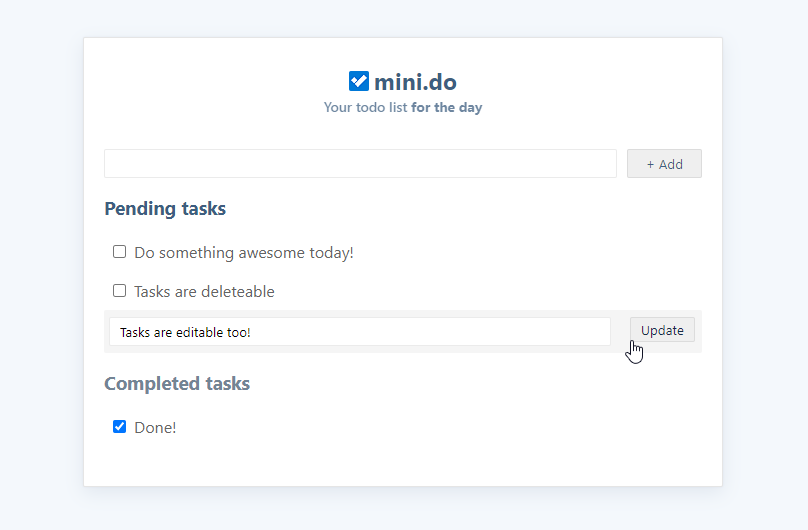

#  mini.do
A simple todo list built using vanilla JS and localStorage

-----------

## Pending Enhancements
* Localstorage for persistent storage
* (Font)Icons for actions
* Responsive app
* Timestamps (humanized) for created/completed datetime
* Show actions on-hover alone for cleaner look

